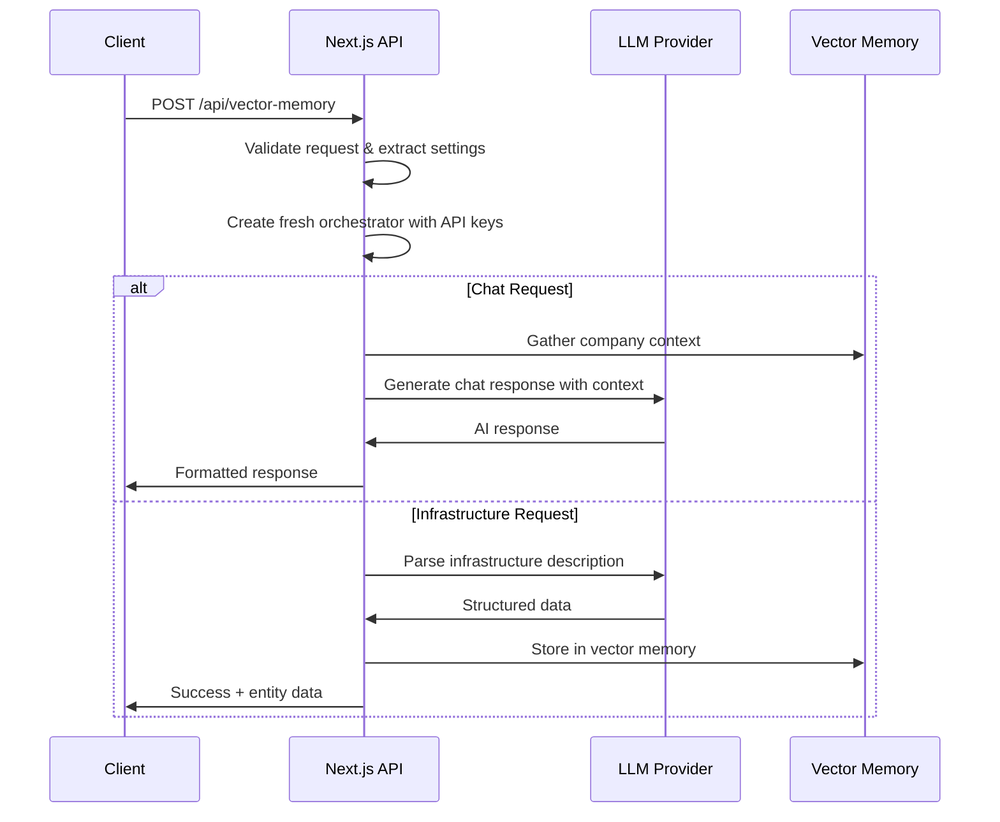

# InfraSim Architecture Documentation

## Overview

InfraSim is a modern infrastructure simulation platform built with **Next.js 14**, **TypeScript**, and **LangChain**. It provides AI-powered infrastructure modeling, real-time simulation, and intelligent chat assistance for designing and analyzing IT infrastructure.

## Core Architecture

```
┌─────────────────────────────────────────────────────────────┐
│                     Frontend (Next.js 14)                  │
├─────────────────────────────────────────────────────────────┤
│  React Components  │  Zustand Stores  │  ReactFlow Graph   │
├─────────────────────────────────────────────────────────────┤
│                     API Layer (Next.js Routes)             │
├─────────────────────────────────────────────────────────────┤
│   LangChain        │  Vector Memory   │  Lambda/OpenAI     │
│   Orchestrator     │  Manager         │  Proxy             │
├─────────────────────────────────────────────────────────────┤
│                     Backend Services                       │
├─────────────────────────────────────────────────────────────┤
│  Simulation Engine │  Model Manager   │  Tool Handlers     │
└─────────────────────────────────────────────────────────────┘
```

## API Architecture

### API Routes Structure

The platform uses Next.js 14 App Router with three main API endpoints:

#### 1. `/api/vector-memory` - Central Data & AI Operations
- **Purpose**: Handles all company memory, infrastructure CRUD, and AI interactions
- **Methods**: POST only (action-based routing)
- **Key Features**:
  - Company management (CRUD operations)
  - Infrastructure parsing and generation
  - Chat response generation
  - Vector similarity search
  - Model configuration management

**Supported Actions**:
```typescript
// Company Operations
'addCompany' | 'getAllCompanies' | 'updateCompany' | 'searchCompanies'

// Infrastructure Operations  
'addCompanyInfrastructure' | 'removeCompanyInfrastructure' | 
'updateCompanyInfrastructure' | 'getCompanyInfrastructure' |
'parseInfrastructure' | 'describeInfrastructureLayout'

// AI Operations
'generateChatResponse' | 'createOrganization'

// Configuration
'updateModelConfiguration'
```

#### 2. `/api/lambda-proxy` - External LLM Proxy
- **Purpose**: Proxies requests to Lambda Labs API to avoid CORS issues
- **Security**: Handles API key management server-side
- **Format**: OpenAI-compatible API format
- **Models Supported**: Llama 4 Maverick, Llama 3.1, etc.

#### 3. `/api/langchain-agent` - Tool-Based AI Agent
- **Purpose**: Structured tool execution with AI agents
- **Features**: Zod schema validation, retry logic, fallback handling
- **Tools**: Infrastructure modification, company creation, simulation control

### Request/Response Flow



## LLM Integration Architecture

### Multi-Model Support System

InfraSim supports multiple LLM providers through a sophisticated model management system:

#### Supported Providers
1. **Lambda Labs** (Primary) - Llama models via proxy
2. **OpenAI** - GPT models with function calling
3. **Ollama** - Local models (Llama, Mistral, etc.)
4. **Anthropic** - Claude models (planned)

#### Model Manager (`DualModelManager`)

The system uses a dual-model approach:

```typescript
interface ModelRoles {
  CHAT: 'chat';    // Conversational responses
  TOOLS: 'tools';  // Structured data parsing
}
```

**Model Configuration**:
```typescript
interface ModelConfig {
  id: string;                    // Model identifier
  type: 'lambda' | 'openai' | 'ollama';
  processingMode: ProcessingMode;
  apiKey?: string;
  temperature?: number;
}
```

#### Processing Modes

Different models require different processing strategies:

```typescript
enum ProcessingMode {
  LLAMA_CHAT = 'llama_chat';           // Custom Llama formatting
  OPENAI_TOOLS = 'openai_tools';       // Function calling support
  STRUCTURED_OUTPUT = 'structured_output'; // Traditional parsing
  AUTO_DETECT = 'auto_detect';         // Model-based detection
}
```

### LLM Request Pipeline

#### 1. Prompt Formatting
Different formatters for different model types:

**Llama Models** (Custom formatting):
```typescript
class LlamaPromptFormatter {
  formatChatPrompt(systemMessage: string, userMessage: string): string {
    return `<|begin_of_text|><|start_header_id|>system<|end_header_id|>
${systemMessage}
<|eot_id|><|start_header_id|>user<|end_header_id|>
${userMessage}
<|eot_id|><|start_header_id|>assistant<|end_header_id|>`;
  }
}
```

**OpenAI/Lambda Models** (Standard formatting):
```typescript
class OpenAIPromptFormatter {
  formatChatPrompt(systemMessage: string, userMessage: string): string {
    return userMessage; // LangChain handles system message separately
  }
}
```

#### 2. Response Parsing
Enhanced parsing with multiple fallback strategies:

```typescript
class LlamaJsonParser {
  static parseWithRetry(jsonString: string): any {
    // Strategy 1: Direct JSON.parse()
    // Strategy 2: Extract from markdown code blocks
    // Strategy 3: Extract from assistant response format
    // Strategy 4: Find JSON-like structures
    // Strategy 5: Clean and fix common formatting issues
    // Strategy 6: Repair malformed JSON
  }
}
```

#### 3. Context Enhancement
The system builds comprehensive context for AI interactions:

```typescript
interface EnhancedContext {
  company: CompanyContext;
  infrastructureNodesJSON: string;  // Complete node data as JSON
  infrastructureSummary: string;    // Human-readable summary
  chatHistory: ChatMessage[];
  simulationState: SimulationState;
  conversationTopic: string;
}
```

### Tool-Based AI System

#### Tool Schema Definition
Using Zod for strict type validation:

```typescript
const CreateCompanySchema = z.object({
  action: z.literal('createCompany'),
  parameters: z.object({
    name: z.string().min(1),
    description: z.string().min(10),
    industry: z.enum(['banking', 'fintech', 'tech', ...]),
    // ... more fields
  })
});
```

#### Tool Execution Flow
1. **Input Validation**: Zod schema validation
2. **LLM Processing**: AI generates structured responses
3. **Retry Logic**: Multiple attempts with exponential backoff
4. **Fallback Handling**: Rule-based fallbacks when AI fails
5. **Result Processing**: Type-safe result handling

## Data Architecture

### Vector Memory System

#### Storage Backend
- **Primary**: FAISS vector index + JSON docstore
- **Location**: `data/vector-store/`
- **Files**: 
  - `faiss.index` - Vector embeddings
  - `docstore.json` - Document metadata

#### Company Memory Schema
```typescript
interface CompanyMemoryRecord {
  id: string;
  name: string;
  description: string;
  sectorTags: string[];
  services: string[];
  infrastructure?: InfrastructureEntity[];
  metadata: {
    industry: string;
    compliance: string[];
    employees: number;
    // ... more fields
  };
  createdAt: Date;
  updatedAt: Date;
}
```

#### Infrastructure Entity Schema
```typescript
interface InfrastructureEntity {
  id: string;
  type: EntityType;
  name: string;
  hostname: string;
  ip: string;
  fidelity: FidelityLevel;
  ports: Port[];
  metadata: Record<string, any>;
  position: { x: number; y: number };
  connections: string[];
  logs: LogEntry[];
}
```

### State Management

#### Frontend State (Zustand)
- **App Store**: Global application state, logs, UI state
- **Settings Store**: User preferences, API keys, model configuration

#### Backend State
- **Singleton Orchestrator**: Cached LLM instances
- **Vector Memory**: In-memory + persistent storage
- **Simulation Engine**: Real-time entity state

## Security Architecture

### API Key Management
- **Client-side**: Stored in localStorage (encrypted in production)
- **Server-side**: Environment variables for fallback keys
- **Proxy Pattern**: Lambda Labs API accessed via server proxy to avoid CORS

### Request Security
- **Input Validation**: Zod schema validation on all inputs
- **Rate Limiting**: Built-in retry logic with exponential backoff
- **Error Handling**: Sanitized error messages, detailed server logs

### Data Security
- **Vector Store**: Local file system (data/vector-store/)
- **No External Dependencies**: All AI operations can run locally via Ollama
- **API Key Rotation**: Support for dynamic key updates

## Performance Architecture

### Caching Strategy
- **Model Instances**: Singleton pattern for LLM instances
- **Vector Memory**: In-memory caching with lazy loading
- **Response Caching**: LLM response logging for debugging

### Optimization Techniques
- **Prompt Engineering**: Model-specific prompt optimization
- **Context Compression**: Intelligent context summarization
- **Parallel Processing**: Concurrent tool execution where possible
- **Lazy Loading**: Components and data loaded on demand

### Scalability Considerations
- **Stateless API**: Each request includes full context
- **Horizontal Scaling**: Supports multiple instances with shared storage
- **Model Switching**: Hot-swap between different LLM providers
- **Resource Management**: Configurable timeouts and limits

## Development Architecture

### Build System
- **Framework**: Next.js 14 with App Router
- **TypeScript**: Strict type checking throughout
- **Build Tools**: Native Next.js build system
- **Development**: Hot reload with concurrent Ollama startup

### Code Organization
```
src/
├── app/                 # Next.js app router
│   ├── api/            # API route handlers
│   └── infrastructure/ # Main application page
├── components/         # React components
├── core/              # Core business logic
├── store/             # State management
├── tools/             # AI tool definitions
└── types/             # TypeScript definitions
```

### Testing Strategy
- **Type Safety**: Comprehensive TypeScript coverage
- **Schema Validation**: Zod runtime validation
- **Error Boundaries**: Graceful degradation
- **Fallback Systems**: Multiple layers of fallbacks

## Deployment Architecture

### Production Deployment
- **Static Generation**: Next.js static site generation where possible
- **Server Components**: API routes for dynamic functionality
- **Asset Optimization**: Automatic Next.js optimizations
- **Environment Management**: Multi-environment configuration

### Local Development
```bash
npm run dev  # Starts Next.js + Ollama concurrently
npm run setup  # Initial setup with model downloads
npm run seed   # Populate with sample data
```

### Dependencies
- **Core**: Next.js, React, TypeScript, LangChain
- **AI**: @langchain/community, @langchain/openai
- **UI**: ReactFlow, Tailwind CSS, Lucide React
- **State**: Zustand, Zod
- **Vector**: FAISS-node, pickleparser

This architecture provides a robust, scalable, and maintainable foundation for AI-powered infrastructure simulation while maintaining flexibility for different deployment scenarios and LLM providers.